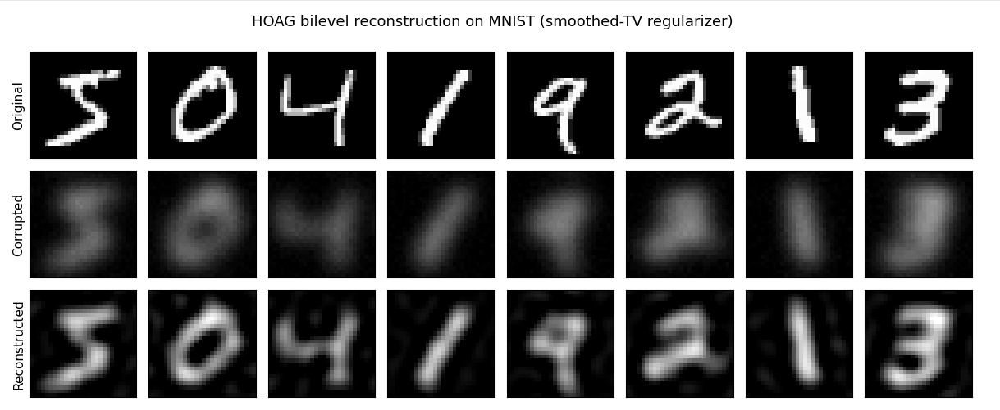
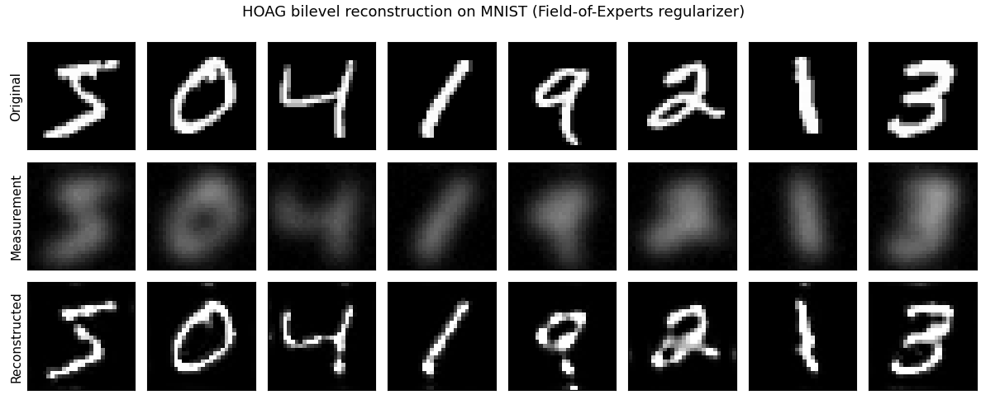

# Bilevel Learning for Image Reconstruction using Regularisers

Bilevel learning of a **regulariser** for pure image reconstruction on MNIST, trained with
**HOAG** (Hyperparameter Optimization with Approximate Gradients). The lower level reconstructs a
blurred, noisy image; the upper level tunes the regulariser's parameters so the reconstruction is close
to the clean image in mean-squared error (MSE). Two regularisers are implemented: a **smoothed
total-variation (TV)** prior and a **Fields-of-Experts (FoE)** prior.

Internship project — GRISHMA Summer Intern, Department of Electronics and Electrical Communication
Engineering, IIT Kharagpur. Supervisor: Prof. Subhadip Mukherjee.

---

## Overview

- **Lower level:** reconstruct the image by minimising `½‖y − Ax‖² + g_θ(x)` (data fidelity + regulariser).
- **Upper level:** tune the regulariser parameters `θ` to minimise the reconstruction MSE against the
  clean image. Unlike the task-adapted SPCOM framework, **there is no task network** — the upper
  objective is pure reconstruction error.
- **Training (HOAG):** the outer gradient (the *hypergradient*) is obtained from the Implicit Function
  Theorem; the inverse Hessian is applied by **Conjugate Gradient** using only Hessian–vector products
  (so the Hessian is never formed); the inner/CG tolerance shrinks over the run.
- **Setup:** 100 MNIST digits, `28×28`, degraded by a `23×23` Gaussian blur (σ = 3) plus Gaussian noise
  (σ = 0.01); a Wiener pseudo-inverse `A†y` is used to warm-start the inner solver.

**Result (TV):** PSNR improves from **12.90 dB** (blurred/noisy input) to **15.77 dB**
(reconstruction) on the 100-image set.

**Result (FoE):** PSNR improves from **12.90 dB** (blurred/noisy input) to **16.49 dB**
(reconstruction) on the 100-image set.

---

## Repository structure

```
.
├── README.md
├── requirements.txt
├── bi_level_hoag.py     # from-scratch reconstruction: TV run + gradient check + FoE variant
├── mnistbilevel.py      # driver for the task-adapted / TV / FoE experiments (see note below)
└── results/             # demo images (add tv_reconstruction.png, foe_reconstruction.png here)
```

### `bi_level_hoag.py`
Self-contained implementation. It includes:
- the **TV and FoE** bilevel-HOAG reconstruction (`Physics2D`, `tv_regularizer`, `solve_inner`,
  `conjugate_gradient`, `hoag_hypergradient`, `run_hoag`), and a PSNR readout;
- a small **NumPy gradient check** that compares the HOAG hypergradient against a finite-difference
  estimate (sanity check that the derivation is coded correctly);
- a **Fields-of-Experts** variant (`foe_regularizer`, 136-parameter filter bank initialised from
  Sobel + Laplacian-of-Gaussian stencils).

### `mnistbilevel.py`
A driver notebook (exported from Colab) that clones the companion repository
[`bl_of_tar`](https://github.com/aryan18072003/bl_of_tar), patches its config files, and runs the
task-adapted experiments (`upper_bound`, `sequential`, `end_to_end`, `joint`) followed by the
`mnist_tv` and `mnist_foe` bilevel runs, saving sample images to `results/`.

---

## Requirements

Python 3.10+ and the packages in `requirements.txt`:

```bash
pip install -r requirements.txt
```

---

## How to run

> **Important:** both files were exported from Google Colab. `mnistbilevel.py` contains shell/magic
> lines (`!git clone`, `!pip install`, `%cd`) that only work inside Colab or Jupyter, and
> `bi_level_hoag.py` is a concatenation of Colab cells that are meant to be run **in order**. The
> easiest way to reproduce the results is to open the original notebooks in Colab (or paste the cells
> into a fresh notebook). Running `python file.py` directly may need the magic lines removed first.

**Reconstruction (TV + FoE + gradient check):**
```bash
python bi_level_hoag.py      # or run cell-by-cell in Colab/Jupyter
```
This downloads MNIST, degrades the first 100 images, learns the regulariser with HOAG, prints the
before/after PSNR, and plots Ground Truth / Degraded / Reconstructed panels.

**Task-adapted / TV / FoE experiments:**
```bash
# best run in Colab — it clones the bl_of_tar repo and installs its dependencies
python mnistbilevel.py
```

---

## Results/Demo

The reconstructions produced by the two regularisers (top row: originals, middle: blurred + noisy,
bottom: reconstructions):




---

## Conclusion

In this internship, I implemented a bilevel learning framework for image reconstruction on the MNIST
Dataset. By taking inspiration from the SPCOM paper of my supervisor, the task network was removed, us-
ing the reconstructed Mean Squared Error (MSE) as the upper-level objective. The implementation included
the lower-level optimization, hypergradient computation using implicit differentiation, and optimization of
the regulariser parameters. Experimental results on blurred and noisy MNIST images showed a clear im-
provement in reconstruction quality, demonstrating that the proposed approach works effectively. This
project also helped me gain a better understanding of optimization, inverse problems, and bilevel learning
which can be later extenede to medical imaging applications


---

## Acknowledgements

Carried out under the supervision of Prof. Subhadip Mukherjee (IIT Kharagpur), building on his group's
SPCOM work on bilevel learning of task-adapted regularisers.
